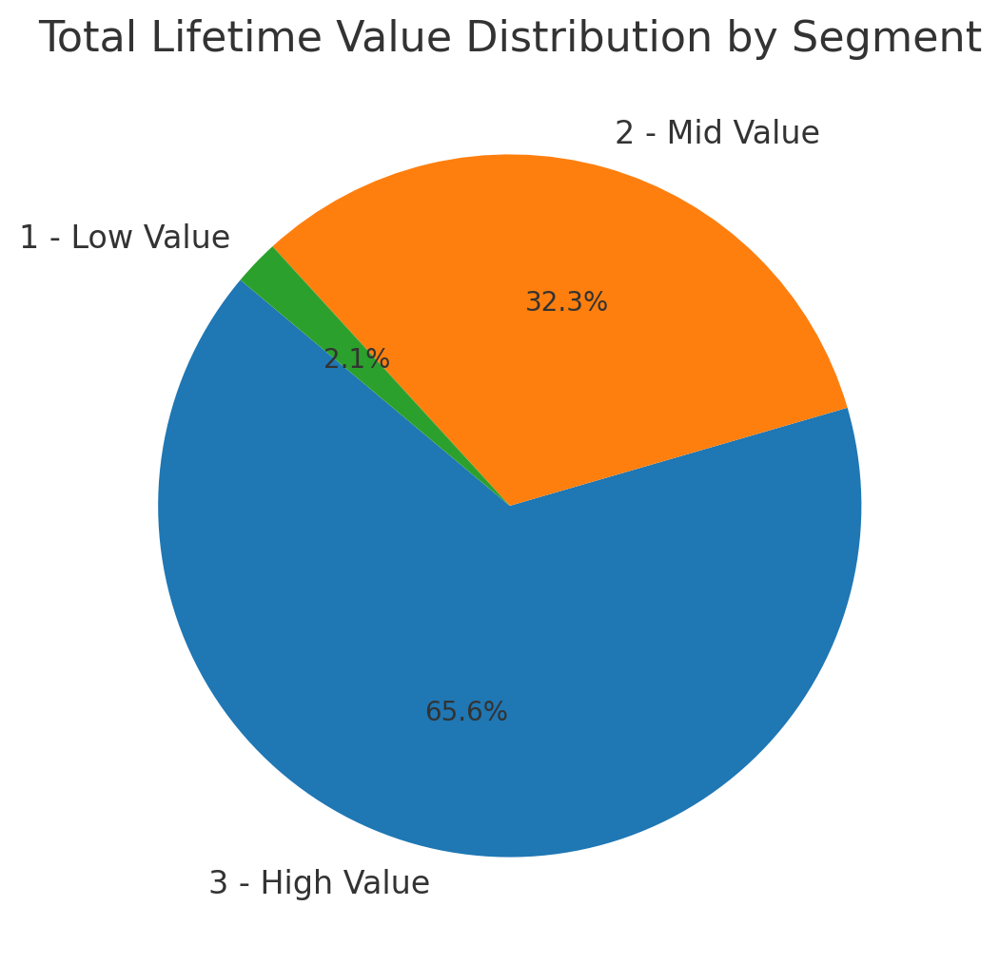
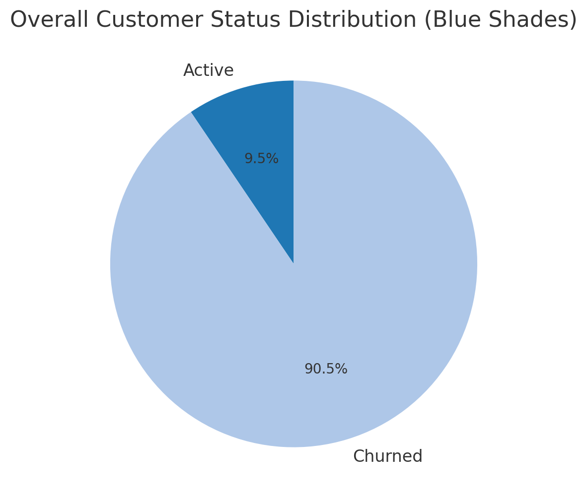
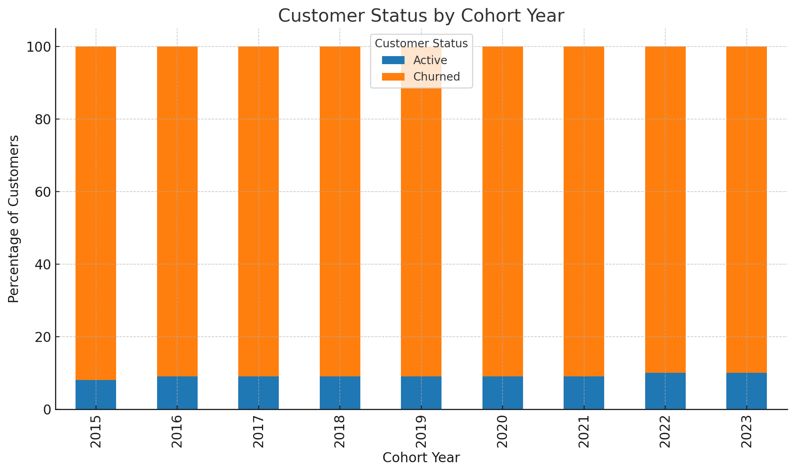

# INTERMEDIATE SQL - Sales Analysis 

## Overview
Analysis of customer behavior, retention, and lifetime value for and e-commerce company to improve customer retention and maximize revenue. 

## Business Questions
1. **Customer Segmentation** Who are our most valuable customers?
2. **Cohort Analysis:** How do different customer groups generate revenue?
3. **Retention Analysis** Who hasn't purchased recently?

## Analysis Approach

### 1. Customer Segmentation
- Categorized customers based on total lifetime value (LTV)
- Assigned customers to High, Mid, and Low-Value segments
- Calculated key metrics: total revenue

Query: [1_customer_segmentation.sql](Scripts/1_customer_segmentation.sql)

**Visualization;**

**Key Findings;**
- High-Value segment (25% of customers) drives 66% of revenue (135.4M)
- Mid-Value segment (50% of customers) generates 32% of revenue (66.6M)
- Low-Value segment (25% of customers) accounts for 2% of the revenue (4.3M)

**Business Insights;**
- High-Value (66% revenue): Offer premium membership program to 12,372 VIP customers, as losing one customer significantly impacts revenue
- Mid-Value (32% revenue): Create upgrade paths through personalized promotions, with potential $66.6M -> $135.4M revenue opportunity
- Low-Value (2% revenue): Design re-engagement campaigns and price-sensitive promotions to increase purchase frequency

### 2. Cohort_Analysis
- Tracked revenue and customer count per cohorts
- Cohorts were grouped by year of first purchase
- Analyzed customer retention at a cohort level

Query: 

[2_cohort_analysis.sql](/Scripts/2_cohort_analysis.sql)

**Visualization;**

**Key Findings;**
- Revenue per customer shows an decreasing trend over time
    - 2022-2024 cohorts are consistently performing worse than earlier cohorts.
    - NOTE: Although net revenue is increasing, this is likely due to a larger customer base, which is not reflective of customer value.

**Business Insights;**
- Value extracted from customers is decreasing over time and needs further investigation.
- In 2023 we saw a drop in number of customers acquired, which is concerning.
- With both lowering LTV and decreasing customer acquisition, the company is facing a potential revenue decline.

### 3. Retention Analysis
- Identified customers at risk of churning
- Analyzed last purchase patterns
- Calculated customer-specific metrics

Query: [3_retention_analysis.sql](Scripts/3_retention_analysis.sql)

**Visualization;**

**Key Findings;**
- Cohort churn stabilizes at ~90% after 2-3 years,
indicating a predictable long-term retention pattern.
- Retention rates are consistently low (8-10%) across all cohorts, suggesting retention issues are systemic rather than specific to certain years.
- Newer cohorts (2022-2023) show similar church trajectories, signaling that without intervention,
future cohorts will follow the same pattern.

**Business Insights;**
- Strengthen early engagement strategies to target the first 1-2 years with onboarding incentives,
loyalty rewards, and personalized offers to improve long-term retention.
- Re-engage high-value churned customers by focusing on targeted  win-back campaigns rather than broad retention efforts, as reactivating valuable users may yield higher ROI.
- Predict & Preempt churn risk and use customer-specific warning indicators to proactively intervene with at-risk users before they lapse. 

## Technical Details
- **Database;** PostgreSQL
- **Analysis Tool;** PostgreSQL
- **Visualization;** ChatGPT